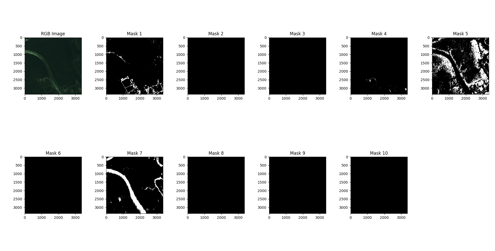

# Code for solving Kaggle challenge: `Dstl Satellite Imagery Feature Detection`

## Models

### UNet
A 5 step encode/decode UNet. It accepts images in 224x224 patches,
squeezes to 7x7 in bottleneck and outputs the same 224x224 at the end.
No cropping is done at each convolution step. Input and output channels
are configurable. I used 20 input channels (all wavelengths) and
10 output channels (all segmentation classes).

Model also has BatchNorm and Dropout(p=0.2) (mostly in the encoder).

A sigmoid is used at the very end which is paired with either binary cross
entropy (BCE) loss or BCE+Dice loss to get binary segmentation masks for each class in each
output channel.

### Res50UNet
A regular 4 step UNet with ResNet50 as a backbone (encoder+bottleneck).

Initial operations (7x7 strided conv, batch norm, ReLU) are replaced with
a residual double convolution that takes a skip connection from original 20
input channels (feature map dimensions are aligned using 1x1 conv, as per original ResNet paper).
MaxPooling operation is left as is.

Additionally, dropouts are added to internal bottlenecks of ResNet layers 3 and 4.

Model works well with pretrained backbones, especially ones trained on similar
satellite data (e.g., [Sentinel-2](https://www.esa.int/Applications/Observing_the_Earth/Copernicus/Sentinel-2)).

## Segmentation
Inference is able to output overlay and individual segmentation masks as well as
calculate IoU/Dice for a given output. Example of segmentation visualization
for image `6070_2_3`, performed by UNet trained on 50 epochs with batch size of 128:

## How to train
1. Install required dependencies using the freeze [requirements.txt](requirements.txt) file
2. Specify directories to training/validation data paths in [data.py](src/data.py)
3. Change desired training configurations in main loop of [train.py](src/train.py). Keep in mind that `SatellitePatchesDataset` can either load all images into memory at once, or load them one by one
4. Run [train.py](src/train.py)

## How to run inference
1. Inside [infer.py](src/infer.py):
   1. Initialize your model
   2. Call `infer_display`, passing in your model, image_id (from the dataset), and path to model weights (if any)